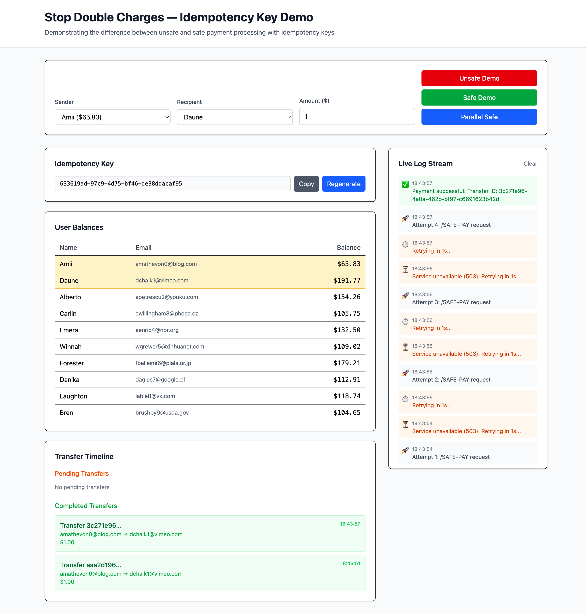

# Stop Double Charges — Idempotency Key Demo

> A tiny demo showing **why retries cause double charges** and **how idempotency + a state machine** prevents them, using a simple Node/Express backend and a lightweight HTML/Tailwind frontend.

---

## Watch the video walkthrough

* 🎥 **Video walkthrough:** 🔧 *Add YouTube link here*
* 📺 **DuaLearn channel:** 🔧 *Add channel link here*
* Follow along for more practical, production-grade patterns.




---

## What this is

* **Problem (Unsafe):** Under server hiccups (503 + `Retry-After`), clients retry — and if your API isn’t idempotent, each retry **executes a fresh debit** → **double spend**.
* **Solution (Safe):** The client sends an **Idempotency-Key** per user intent. The server creates **one** `PENDING` transfer, returns 503 while it’s in progress, then finalizes once on the last attempt → **single debit**. Further retries **reuse the same result**.

---

## Why it matters

* Real users (and SDKs) **do** retry on lag/timeouts or 5xx.
* Without idempotency, retries create **duplicate charges, angry users, and reconciliation pain**.
* With idempotency + a tiny state machine (`PENDING → COMPLETED`) you get **correctness under retries, crashes, and parallel clicks**.

---

## How it works (quick)

* Both flows simulate hiccups with **three `503 Service Unavailable` + `Retry-After: 1`**, then success on the 4th attempt.
* **`POST /unsafe-pay`**: debits **every** attempt → multiple transfers, balance drops multiple times.
* **`POST /safe-pay`**: first attempt reserves once (`PENDING`), retries reuse **the same transferId**, final attempt flips to `COMPLETED` → balance drops once.
* **`GET /balance`**: returns all users and their balances for the UI table.

---

## Endpoints

* `GET /balance` → `[{ email, name?, balance }]`
* `POST /unsafe-pay`
  Body: `{ senderEmail, recipientEmail, amount }`
  Returns: 503 (x3) then `201 { status:"COMPLETED", transferId, newBalance }`
* `POST /safe-pay`
  Body: `{ senderEmail, recipientEmail, amount, idempotencyKey }`
  Returns: 503 (x3) with `{ status:"processing", idempotencyKey, transferId }`, then `201 { status:"COMPLETED", transferId, newBalance }`
  Errors: `409` if same key with different payload; `404/409` for not found/insufficient funds

---

## What you’ll see in the UI

* **Balances table:** live balances for all users (auto-refreshes during runs)
* **Selectors:** choose Sender & Recipient from dropdowns, set amount
* **Unsafe run:** watch balance drop **every retry** (double spend)
* **Safe run:** one `transferId` goes **Pending → Completed**, balance drops **once**
* **Parallel Safe (5):** 5 concurrent requests with the same key converge to **one** result

---

## Get started

1. **Clone & install**

```bash
git clone https://github.com/pavankpdev/idempotency-implementation.git
cd idempotency-implementation
pnpm install
```

2. **Run the backend**

```bash
pnpm dev
```

3. **Open the frontend**

* Visit: `http://localhost:3001` (🔧 adjust if you use another port)

4. **Try the flows**

* Click **Run Unsafe Demo** → observe multiple debits
* Click **Run Safe Demo** → observe one debit (same Idempotency-Key)
* Try **Parallel Safe (5)** → all converge to a single transfer

---

## Tech notes

* Backend: Node/Express + simple JSON storage (e.g., lowdb)
* Hiccup simulation: **three 503s + `Retry-After: 1`**, then success
* Safe path uses a **per-key lock** and idempotent **finalize** step to prevent races

